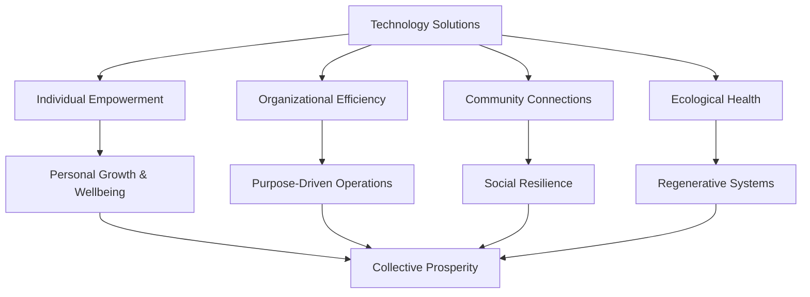

# Collective Prosperity Framework

**Created: 04-Jul-25**

## Table of Contents

1. [Vision & Mission](#vision--mission)
2. [Core Principles](#core-principles)
3. [Category Framework](#category-framework)
4. [App Evaluation Criteria](#app-evaluation-criteria)
5. [Impact Measurement](#impact-measurement)
6. [Community Values](#community-values)
7. [Implementation Guidelines](#implementation-guidelines)
8. [Success Metrics](#success-metrics)

## Vision & Mission

### Vision

Building a robust technology platform where digital and physical worlds unite for growth, fostering collective prosperity through interconnected solutions that benefit individuals, organizations, communities, and our planet.

### Mission

To create a transformative app ecosystem that:

- **Empowers** individuals to reach their full potential
- **Enables** organizations to operate with purpose and efficiency
- **Strengthens** communities through resilience and collaboration
- **Regenerates** our ecological systems
- **Connects** existing solutions for maximum collective impact

### Core Purpose

The SaSarjan App Store is not just a marketplace—it's a **discovery platform for collective prosperity**, curating both internal innovations and external solutions that align with our vision of holistic growth and shared wellbeing.

## Core Principles

### 1. **Interconnectedness**

- Solutions should enhance connections between people, organizations, and ecosystems
- Apps must support data portability and interoperability
- Encourage collaborative features over competitive isolation

### 2. **Regenerative Impact**

- Beyond sustainability: actively improve social and ecological systems
- Measure success by positive outcomes, not just usage metrics
- Prioritize long-term collective benefit over short-term individual gain

### 3. **Inclusive Access**

- Technology should be accessible to all, regardless of economic status
- Support multiple languages, cultures, and contexts
- Design for low-bandwidth and offline scenarios

### 4. **Community Sovereignty**

- Users and communities own their data
- Transparent governance and decision-making
- Local adaptation and customization capabilities

### 5. **Ethical Technology**

- Privacy by design
- Open source preferred
- No dark patterns or manipulative design
- Transparent algorithms and AI

### 6. **Holistic Value**

- Recognize multiple forms of value beyond monetary
- Support gift economies and mutual aid
- Enable resource sharing and collective ownership

## Category Framework

### Primary Categories

#### 1. **Personal Transformation**

_Empowering individual growth and self-realization_

- **Subcategories**:
  - Mindfulness & Meditation
  - Skill Development
  - Health & Wellness
  - Creative Expression
  - Personal Finance
  - Life Planning

- **Example Apps**:
  - Meditation timers with community sessions
  - Skill-sharing platforms
  - Holistic health trackers
  - Digital journals with growth insights
  - Financial literacy tools

#### 2. **Organizational Excellence**

_Enabling purpose-driven and efficient operations_

- **Subcategories**:
  - Collaborative Management
  - Impact Measurement
  - Resource Optimization
  - Team Wellbeing
  - Sustainable Operations
  - Innovation Labs

- **Example Apps**:
  - Sociocracy decision-making tools
  - Carbon footprint trackers
  - Collective intelligence platforms
  - Remote collaboration spaces
  - Circular economy marketplaces

#### 3. **Community Resilience**

_Strengthening social bonds and collective capacity_

- **Subcategories**:
  - Mutual Aid Networks
  - Local Governance
  - Disaster Preparedness
  - Community Gardens
  - Skill Exchanges
  - Neighborhood Care

- **Example Apps**:
  - Time banking systems
  - Community resource maps
  - Emergency response coordinators
  - Local food networks
  - Participatory budgeting tools

#### 4. **Ecological Regeneration**

_Healing and enhancing natural systems_

- **Subcategories**:
  - Biodiversity Monitoring
  - Regenerative Agriculture
  - Water Conservation
  - Renewable Energy
  - Waste Reduction
  - Ecosystem Restoration

- **Example Apps**:
  - Species identification and tracking
  - Permaculture design tools
  - Water usage monitors
  - Solar panel calculators
  - Zero waste challenges

#### 5. **Economic Empowerment**

_Creating equitable and sustainable livelihoods_

- **Subcategories**:
  - Cooperative Platforms
  - Fair Trade Networks
  - Local Currencies
  - Crowdfunding
  - Skills Marketplace
  - Social Enterprises

- **Example Apps**:
  - Worker cooperative management
  - Local exchange trading systems
  - Ethical investment platforms
  - Peer-to-peer lending
  - Social impact bonds

#### 6. **Knowledge Commons**

_Democratizing access to wisdom and learning_

- **Subcategories**:
  - Open Education
  - Indigenous Wisdom
  - Research Collaboration
  - Language Preservation
  - Traditional Practices
  - Peer Learning

- **Example Apps**:
  - Open courseware platforms
  - Traditional knowledge archives
  - Collaborative research tools
  - Language learning exchanges
  - Wisdom circles

#### 7. **Social Innovation**

_Catalyzing positive social change_

- **Subcategories**:
  - Civic Engagement
  - Social Justice
  - Conflict Resolution
  - Volunteer Coordination
  - Advocacy Tools
  - Movement Building

- **Example Apps**:
  - Petition platforms
  - Community organizing tools
  - Restorative justice circles
  - Volunteer matching
  - Campaign coordinators

#### 8. **Cultural Expression**

_Preserving heritage and enabling creativity_

- **Subcategories**:
  - Digital Storytelling
  - Art Communities
  - Music Collaboration
  - Cultural Archives
  - Festival Organization
  - Creative Commons

- **Example Apps**:
  - Oral history recorders
  - Collaborative art spaces
  - Music sharing platforms
  - Cultural event calendars
  - Digital museums

## App Evaluation Criteria

### Prosperity Impact Assessment

```typescript
interface ProsperityImpact {
  // Quantitative Metrics
  metrics: {
    usersImpacted: number;
    communitiesServed: number;
    resourcesSaved: number;
    connectionsCreated: number;
  };

  // Qualitative Assessment
  outcomes: {
    personalGrowth: ImpactLevel;
    organizationalHealth: ImpactLevel;
    communityStrength: ImpactLevel;
    ecologicalBenefit: ImpactLevel;
  };

  // Alignment Scoring
  alignment: {
    visionAlignment: number; // 0-100
    principleAdherence: number; // 0-100
    communityValidation: number; // 0-100
  };
}

enum ImpactLevel {
  Transformative = 5,
  Significant = 4,
  Moderate = 3,
  Minor = 2,
  Minimal = 1
}
```

### Evaluation Framework

#### 1. **Purpose Alignment**

- Does the app contribute to collective prosperity?
- Are its goals aligned with our vision?
- Does it address real community needs?

#### 2. **Ethical Standards**

- Privacy protection measures
- Data sovereignty support
- Transparent operations
- No exploitation or harm

#### 3. **Accessibility**

- Multi-language support
- Low-bandwidth functionality
- Offline capabilities
- Economic accessibility

#### 4. **Interconnectedness**

- API availability
- Data portability
- Integration capabilities
- Collaboration features

#### 5. **Sustainability**

- Business model viability
- Environmental impact
- Long-term maintenance plan
- Community support

#### 6. **Innovation**

- Novel approach to problems
- Creative use of technology
- Potential for scaling impact
- Adaptability to contexts

### Scoring Matrix

| Criteria           | Weight   | Score (1-5) | Weighted Score |
| ------------------ | -------- | ----------- | -------------- |
| Purpose Alignment  | 25%      | -           | -              |
| Ethical Standards  | 20%      | -           | -              |
| Accessibility      | 20%      | -           | -              |
| Interconnectedness | 15%      | -           | -              |
| Sustainability     | 10%      | -           | -              |
| Innovation         | 10%      | -           | -              |
| **Total**          | **100%** | -           | **-**          |

**Minimum Score for Acceptance**: 3.5/5.0

## Impact Measurement

### Theory of Change



### Key Performance Indicators (KPIs)

#### Individual Level

- Skills developed
- Wellbeing improvements
- Economic opportunities created
- Creative expressions shared

#### Organizational Level

- Efficiency gains
- Impact measurements
- Collaboration instances
- Sustainability improvements

#### Community Level

- Connections formed
- Resources shared
- Problems solved collectively
- Resilience indicators

#### Ecological Level

- Carbon reduced/sequestered
- Biodiversity supported
- Resources conserved
- Systems regenerated

### Impact Tracking

```typescript
interface ImpactTracking {
  // Real-time metrics
  realtime: {
    activeUsers: number;
    activeProjects: number;
    resourcesShared: number;
    connectionsLive: number;
  };

  // Periodic assessments
  periodic: {
    outcomeStories: Story[];
    communityFeedback: Feedback[];
    impactReports: Report[];
    sustainabilityMetrics: Metrics[];
  };

  // Long-term indicators
  longterm: {
    systemicChanges: Change[];
    policyInfluences: Policy[];
    culturalShifts: Shift[];
    regenerativeOutcomes: Outcome[];
  };
}
```

## Community Values

### Guiding Values

1. **Ubuntu** - "I am because we are"
   - Recognizing our fundamental interconnectedness
   - Prioritizing collective wellbeing

2. **Regeneration** - Leaving things better than we found them
   - Going beyond sustainability
   - Active healing and improvement

3. **Inclusion** - Everyone has a place at the table
   - Celebrating diversity
   - Removing barriers to participation

4. **Wisdom** - Honoring all forms of knowledge
   - Traditional and modern
   - Experiential and academic

5. **Joy** - Prosperity includes happiness and fulfillment
   - Celebrating successes
   - Finding meaning in contribution

6. **Courage** - Taking bold action for positive change
   - Challenging status quo
   - Supporting innovation

### Value Implementation

```typescript
interface ValueAlignment {
  ubuntu: {
    communityFeatures: boolean;
    sharedResources: boolean;
    collectiveDecisions: boolean;
  };

  regeneration: {
    positiveExternalities: boolean;
    systemHealing: boolean;
    futureOriented: boolean;
  };

  inclusion: {
    accessibilityScore: number;
    languageSupport: string[];
    economicAccessibility: boolean;
  };

  wisdom: {
    knowledgeSharing: boolean;
    traditionalRespect: boolean;
    learningOriented: boolean;
  };

  joy: {
    userSatisfaction: number;
    meaningfulEngagement: boolean;
    celebrationFeatures: boolean;
  };

  courage: {
    innovationLevel: number;
    systemicChallenge: boolean;
    riskTaking: boolean;
  };
}
```

## Implementation Guidelines

### For App Developers

1. **Start with Why**
   - Clearly articulate how your app contributes to collective prosperity
   - Define measurable positive outcomes
   - Design for interconnection from the start

2. **Build Ethically**
   - Implement privacy by design
   - Use sustainable coding practices
   - Create accessible interfaces
   - Document transparently

3. **Think Systemically**
   - Consider broader impacts
   - Design for emergence
   - Enable local adaptation
   - Support community governance

4. **Measure What Matters**
   - Track real-world outcomes
   - Gather community feedback
   - Share impact stories
   - Iterate based on learning

### For Platform Operators

1. **Curate Thoughtfully**
   - Apply evaluation criteria consistently
   - Seek diverse perspectives
   - Balance innovation with proven solutions
   - Prioritize community needs

2. **Support Ecosystem**
   - Provide developer resources
   - Facilitate app interconnections
   - Share best practices
   - Celebrate successes

3. **Govern Transparently**
   - Make decisions openly
   - Involve community voices
   - Document processes
   - Accept feedback gracefully

4. **Evolve Adaptively**
   - Monitor emerging needs
   - Adjust categories as needed
   - Update criteria based on learning
   - Stay true to core vision

## Success Metrics

### Platform Success Indicators

#### Quantitative Metrics

- Number of lives positively impacted
- Communities strengthened
- Ecological improvements measured
- Economic opportunities created
- Knowledge shared and preserved
- Problems solved collectively

#### Qualitative Indicators

- Story quality and diversity
- Community engagement depth
- Innovation breakthroughs
- Systemic changes catalyzed
- Cultural shifts observed
- Wisdom preserved and shared

### Success Dashboard

```typescript
interface SuccessDashboard {
  // Impact Overview
  overview: {
    totalLivesImpacted: number;
    activeCommunitiesQ: number;
    prosperityIndex: number; // 0-100
    growthTrajectory: Trend;
  };

  // Category Performance
  categories: {
    [category: string]: {
      activeApps: number;
      userEngagement: number;
      impactScore: number;
      topOutcomes: Outcome[];
    };
  };

  // Featured Stories
  stories: {
    individual: TransformationStory[];
    organizational: ExcellenceStory[];
    community: ResilienceStory[];
    ecological: RegenerationStory[];
  };

  // Health Indicators
  health: {
    developerSatisfaction: number;
    userRetention: number;
    communityVibrancy: number;
    platformSustainability: number;
  };
}
```

### Reporting Cadence

- **Daily**: Active user metrics, real-time impact
- **Weekly**: Community stories, app highlights
- **Monthly**: Impact reports, category analysis
- **Quarterly**: Systemic change assessment
- **Annually**: Comprehensive prosperity report

## Future Evolution

### Adaptive Framework

This framework is designed to evolve based on:

- Community feedback and needs
- Emerging global challenges
- Technological innovations
- Learned experiences
- Collective wisdom

### Review Process

- Quarterly community consultations
- Annual framework reviews
- Continuous feedback integration
- Emergent category development
- Impact measurement refinement

### Expansion Possibilities

- Regional adaptations
- Sector-specific frameworks
- Partnership ecosystems
- Global prosperity networks
- Cross-platform integration

---

**Document Version**: 1.0  
**Last Updated**: 04-Jul-25  
**Next Review**: 11-Jul-25

## Quick Links

- [App Store Architecture](./AppStore_Architecture_Plan_03-Jul-25.md)
- [Discovery Platform](./Discovery_Platform_Architecture.md)
- [Community Governance](./Community_Governance.md)
- [Impact Measurement](./Impact_Measurement.md)
