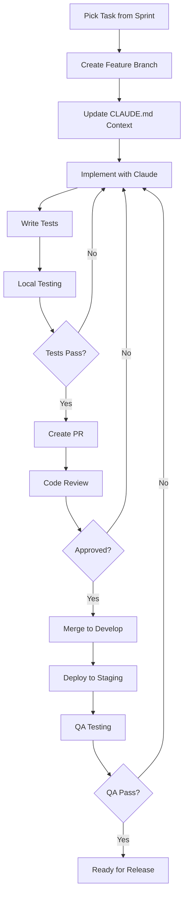
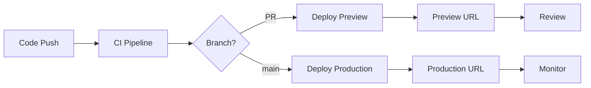

# Development Workflow Guide for SaSarjan App Store

**Created: 03-Jul-25**

## Table of Contents

1. [Development Environment Setup](#development-environment-setup)
   - [Prerequisites](#prerequisites)
   - [Tech Stack Dependencies](#tech-stack-dependencies)
   - [Initial Setup Script](#initial-setup-script)
   - [VS Code Configuration](#vs-code-configuration)
2. [Project Structure](#project-structure)
3. [Git Workflow](#git-workflow)
4. [Development Process](#development-process)
5. [Testing Strategy](#testing-strategy)
6. [CI/CD Pipeline](#cicd-pipeline)
7. [Code Standards](#code-standards)
8. [Security Practices](#security-practices)
9. [Performance Guidelines](#performance-guidelines)
10. [Docker Development Environment](#docker-development-environment)

## Development Environment Setup

### Prerequisites

```bash
# Required tools
node >= 22.0.0
pnpm >= 9.0.0
git >= 2.40.0
docker >= 24.0.0
docker-compose >= 2.20.0
claude-cli >= latest

# CLI tools
vercel >= latest
supabase >= latest
tsx >= latest
turbo >= 2.0.0

# Optional but recommended
postgresql-client >= 15
redis-cli >= 7.0
mapbox-cli >= latest
```

### Tech Stack Dependencies

#### Core Dependencies

```json
{
  "dependencies": {
    // Next.js & React
    "next": "^15.0.0",
    "react": "^19.0.0",
    "react-dom": "^19.0.0",

    // TypeScript
    "typescript": "^5.5.0",

    // Styling
    "tailwindcss": "^3.4.0",
    "postcss": "^8.4.47",
    "autoprefixer": "^10.4.20",
    "class-variance-authority": "^0.7.1",
    "clsx": "^2.1.1",
    "tailwind-merge": "^2.5.5",

    // UI Components
    "@radix-ui/react-accordion": "^1.2.2",
    "@radix-ui/react-alert-dialog": "^1.1.3",
    "@radix-ui/react-aspect-ratio": "^1.1.1",
    "@radix-ui/react-avatar": "^1.1.2",
    "@radix-ui/react-checkbox": "^1.1.3",
    "@radix-ui/react-collapsible": "^1.1.2",
    "@radix-ui/react-context-menu": "^2.2.3",
    "@radix-ui/react-dialog": "^1.1.3",
    "@radix-ui/react-dropdown-menu": "^2.1.3",
    "@radix-ui/react-hover-card": "^1.1.3",
    "@radix-ui/react-label": "^2.1.1",
    "@radix-ui/react-menubar": "^1.1.3",
    "@radix-ui/react-navigation-menu": "^1.2.2",
    "@radix-ui/react-popover": "^1.1.3",
    "@radix-ui/react-progress": "^1.1.1",
    "@radix-ui/react-radio-group": "^1.2.2",
    "@radix-ui/react-scroll-area": "^1.2.1",
    "@radix-ui/react-select": "^2.1.3",
    "@radix-ui/react-separator": "^1.1.1",
    "@radix-ui/react-slider": "^1.2.2",
    "@radix-ui/react-slot": "^1.1.1",
    "@radix-ui/react-switch": "^1.1.2",
    "@radix-ui/react-tabs": "^1.1.2",
    "@radix-ui/react-toast": "^1.2.3",
    "@radix-ui/react-toggle": "^1.1.1",
    "@radix-ui/react-toggle-group": "^1.1.1",
    "@radix-ui/react-tooltip": "^1.1.5",

    // Icons
    "lucide-react": "^0.468.0",

    // Animation
    "framer-motion": "^11.15.0",

    // Forms & Validation
    "react-hook-form": "^7.54.2",
    "zod": "^3.24.1",
    "@hookform/resolvers": "^3.10.1",

    // Internationalization
    "next-intl": "^3.26.2",

    // Date & Time
    "date-fns": "^4.1.0",
    "react-day-picker": "^9.4.4",

    // Maps
    "mapbox-gl": "^3.8.0",
    "@mapbox/mapbox-gl-geocoder": "^5.0.3",
    "react-map-gl": "^7.1.7",

    // State Management
    "zustand": "^5.0.2",
    "@tanstack/react-query": "^5.64.0",

    // Authentication & Database
    "@supabase/supabase-js": "^2.47.10",
    "@supabase/auth-helpers-nextjs": "^0.10.0",
    "@supabase/auth-ui-react": "^0.4.7",
    "@supabase/auth-ui-shared": "^0.1.8",

    // Payments
    "razorpay": "^2.9.5",

    // File Uploads
    "react-dropzone": "^14.3.5",

    // Charts & Data Visualization
    "recharts": "^2.13.3",

    // Utilities
    "nanoid": "^5.0.9",
    "slugify": "^1.6.6",
    "sanitize-html": "^2.13.1",

    // API & Networking
    "axios": "^1.7.9",
    "swr": "^2.3.0",

    // Security
    "bcryptjs": "^2.4.3",
    "jsonwebtoken": "^9.0.2",

    // Background Jobs
    "bull": "^4.16.3",
    "ioredis": "^5.4.2",

    // Email
    "nodemailer": "^6.9.16",
    "@react-email/components": "^0.0.31",

    // Monitoring & Analytics
    "@sentry/nextjs": "^8.43.0",
    "@vercel/analytics": "^1.4.1",
    "@vercel/speed-insights": "^1.1.0"
  },
  "devDependencies": {
    // TypeScript & Type Checking
    "@types/node": "^22.10.2",
    "@types/react": "^19.0.1",
    "@types/react-dom": "^19.0.1",
    "@types/bcryptjs": "^2.4.6",
    "@types/jsonwebtoken": "^9.0.7",
    "@types/nodemailer": "^6.4.20",
    "@types/sanitize-html": "^2.13.0",

    // Linting & Formatting
    "eslint": "^9.17.0",
    "eslint-config-next": "^15.0.0",
    "@typescript-eslint/parser": "^8.18.1",
    "@typescript-eslint/eslint-plugin": "^8.18.1",
    "prettier": "^3.4.2",
    "prettier-plugin-tailwindcss": "^0.6.9",

    // Testing
    "jest": "^29.7.0",
    "@testing-library/react": "^16.1.0",
    "@testing-library/jest-dom": "^6.6.3",
    "@testing-library/user-event": "^14.5.2",
    "jest-environment-jsdom": "^29.7.0",
    "@playwright/test": "^1.49.1",

    // Development Tools
    "husky": "^9.1.7",
    "lint-staged": "^15.3.0",
    "@commitlint/cli": "^19.6.1",
    "@commitlint/config-conventional": "^19.6.0",

    // Build Tools
    "turbo": "^2.3.3",
    "tsx": "^4.19.2",

    // API Testing
    "newman": "^6.2.1",

    // Type Generation
    "openapi-typescript": "^7.4.4",

    // CSS Tools
    "postcss-import": "^16.1.0",
    "postcss-nesting": "^13.0.1"
  }
}
```

#### Package Installation

```bash
# Install all dependencies
pnpm install

# Install specific workspace dependencies
pnpm install --filter @sasarjan/web
pnpm install --filter @sasarjan/api
pnpm install --filter @sasarjan/admin

# Add new dependencies
pnpm add package-name
pnpm add -D dev-package-name

# Update dependencies
pnpm update
pnpm update --latest
```

### Initial Setup Script

```bash
#!/bin/bash
# setup-dev.sh

echo "🚀 Setting up SaSarjan App Store development environment..."

# Clone repository
git clone https://github.com/yourusername/sasarjan-appstore.git
cd sasarjan-appstore

# Install dependencies
pnpm install

# Setup environment
cp .env.example .env.local
echo "⚠️  Please update .env.local with your credentials"

# Setup Supabase
supabase init
supabase start

# Generate TypeScript types from Supabase
supabase gen types typescript --local > types/supabase.ts

# Setup database migrations
supabase migration new initial_schema
# Edit the migration file, then:
supabase db push

# Setup Docker services
echo "🐳 Starting Docker services..."
docker-compose -f docker-compose.dev.yml up -d

# Wait for services to be healthy
echo "⏳ Waiting for services to start..."
sleep 10

# Verify Docker services
docker-compose -f docker-compose.dev.yml ps

# Setup Vercel
vercel link
vercel env pull .env.local

# Setup git hooks
pnpm prepare

# Initialize Claude context
mkdir -p .claude
cp templates/CLAUDE.md .claude/

# Run initial build
pnpm build

echo "✅ Setup complete!"
echo "📦 Docker services running:"
echo "  - Redis: localhost:6379"
echo "  - Bull Board: http://localhost:3001"
echo "  - MinIO: http://localhost:9001 (admin/admin)"
echo "  - MailHog: http://localhost:8025"
echo "  - Adminer: http://localhost:8080"
echo ""
echo "🚀 Run 'pnpm dev' to start developing"
```

### VS Code Configuration

```json
// .vscode/settings.json
{
  "editor.formatOnSave": true,
  "editor.codeActionsOnSave": {
    "source.fixAll.eslint": true
  },
  "typescript.tsdk": "node_modules/typescript/lib",
  "typescript.enablePromptUseWorkspaceTsdk": true,
  "files.exclude": {
    "**/node_modules": true,
    "**/dist": true,
    "**/.turbo": true
  },
  "search.exclude": {
    "**/node_modules": true,
    "**/dist": true,
    "**/.next": true
  }
}
```

### Recommended VS Code Extensions

```json
// .vscode/extensions.json
{
  "recommendations": [
    "dbaeumer.vscode-eslint",
    "esbenp.prettier-vscode",
    "bradlc.vscode-tailwindcss",
    "graphql.vscode-graphql",
    "github.copilot",
    "eamodio.gitlens",
    "usernamehw.errorlens"
  ]
}
```

## Project Structure

### Monorepo Organization

```
SaSarjan-AppStore/
├── apps/                    # Applications
│   ├── api/                # Backend API server
│   │   ├── src/
│   │   │   ├── modules/    # Feature modules
│   │   │   ├── common/     # Shared utilities
│   │   │   ├── config/     # Configuration
│   │   │   └── main.ts     # Entry point
│   │   └── package.json
│   │
│   ├── web/                # Customer-facing web app
│   │   ├── app/           # Next.js app directory
│   │   ├── components/    # React components
│   │   ├── lib/          # Utilities
│   │   └── public/       # Static assets
│   │
│   ├── admin/             # Admin dashboard
│   └── developer-portal/  # Developer portal
│
├── packages/              # Shared packages
│   ├── database/         # Database types & queries
│   ├── ui/              # UI component library
│   ├── sdk/             # Developer SDK
│   ├── types/           # Shared TypeScript types
│   └── utils/           # Shared utilities
│
├── services/             # Microservices
│   ├── wallet/          # Payment & wallet service
│   ├── forms/           # Form builder service
│   ├── analytics/       # Analytics service
│   ├── security/        # Security service
│   └── notifications/   # Notification service
│
├── infrastructure/      # Infrastructure as Code
│   ├── docker/         # Docker configurations
│   ├── k8s/           # Kubernetes manifests
│   └── terraform/     # Cloud infrastructure
│
├── docs/              # Documentation
├── scripts/           # Build & utility scripts
├── tests/            # E2E tests
└── tools/            # Development tools
```

### Package Structure Example

```typescript
// packages/database/src/index.ts
export * from './schemas';
export * from './migrations';
export * from './seeds';
export * from './types';

// packages/ui/src/index.ts
export * from './components';
export * from './hooks';
export * from './utils';
export * from './themes';
```

## Git Workflow

### Branch Strategy

```
main
├── develop
│   ├── feature/[ticket-id]-feature-name
│   ├── bugfix/[ticket-id]-bug-description
│   └── hotfix/[ticket-id]-hotfix-description
└── release/v1.0.0
```

### Commit Convention

```bash
# Format: <type>(<scope>): <subject>

# Types:
feat     # New feature
fix      # Bug fix
docs     # Documentation
style    # Code style (formatting, etc)
refactor # Code refactoring
perf     # Performance improvements
test     # Testing
build    # Build system
ci       # CI/CD
chore    # Chores

# Examples:
git commit -m "feat(wallet): add Razorpay integration"
git commit -m "fix(forms): resolve CTA validation issue"
git commit -m "docs(api): update OpenAPI specification"
```

### Git Hooks (Husky)

```json
// package.json
{
  "scripts": {
    "prepare": "husky install"
  },
  "husky": {
    "hooks": {
      "pre-commit": "lint-staged",
      "commit-msg": "commitlint -E HUSKY_GIT_PARAMS",
      "pre-push": "pnpm test"
    }
  },
  "lint-staged": {
    "*.{ts,tsx}": ["eslint --fix", "prettier --write"],
    "*.{json,md}": ["prettier --write"]
  }
}
```

### Pull Request Template

```markdown
<!-- .github/pull_request_template.md -->

## Description

Brief description of changes

## Type of Change

- [ ] Bug fix
- [ ] New feature
- [ ] Breaking change
- [ ] Documentation update

## Testing

- [ ] Unit tests pass
- [ ] Integration tests pass
- [ ] Manual testing completed

## Checklist

- [ ] Code follows style guidelines
- [ ] Self-review completed
- [ ] Comments added for complex code
- [ ] Documentation updated
- [ ] No new warnings
- [ ] Tests added/updated
- [ ] All tests passing

## Screenshots (if applicable)

## Related Issues

Closes #(issue)
```

## Development Process

### Feature Development Flow



### Daily Development Workflow

```bash
# Morning sync
git checkout develop
git pull origin develop

# Create feature branch
git checkout -b feature/TICKET-123-wallet-integration

# Start development with Claude
claude --chat "I'm working on TICKET-123, implementing wallet integration"

# Development cycle
pnpm dev                    # Start dev servers
# Make changes
pnpm test:watch            # Run tests in watch mode
pnpm lint                  # Check linting
pnpm typecheck             # TypeScript check

# Commit frequently
git add .
git commit -m "feat(wallet): implement balance check"

# Before PR
pnpm test                  # Run all tests
pnpm build                 # Ensure build passes

# Create PR
git push origin feature/TICKET-123-wallet-integration
# Create PR via GitHub/Linear
```

### Code Review Process

```typescript
// Code Review Checklist
interface CodeReviewChecklist {
  functionality: {
    requirement_met: boolean;
    edge_cases_handled: boolean;
    error_handling: boolean;
  };
  code_quality: {
    readable: boolean;
    maintainable: boolean;
    follows_patterns: boolean;
    no_duplication: boolean;
  };
  testing: {
    unit_tests: boolean;
    integration_tests: boolean;
    coverage_adequate: boolean;
  };
  security: {
    input_validation: boolean;
    auth_checks: boolean;
    no_secrets: boolean;
  };
  performance: {
    no_n_plus_one: boolean;
    efficient_queries: boolean;
    proper_caching: boolean;
  };
  documentation: {
    api_docs_updated: boolean;
    comments_clear: boolean;
    readme_updated: boolean;
  };
}
```

## Testing Strategy

### Testing Pyramid

```
         /\
        /E2E\      (5%)  - Critical user journeys
       /------\
      /  API   \   (15%) - API integration tests
     /----------\
    / Integration\ (30%) - Service integration
   /--------------\
  /   Unit Tests   \(50%) - Component/function tests
 /------------------\
```

### Test Structure

```typescript
// Unit Test Example
// packages/wallet/src/services/balance.service.test.ts
describe('BalanceService', () => {
  let service: BalanceService;

  beforeEach(() => {
    service = new BalanceService();
  });

  describe('getBalance', () => {
    it('should return user balance', async () => {
      const balance = await service.getBalance('user-123');
      expect(balance).toBeDefined();
      expect(balance.amount).toBeGreaterThanOrEqual(0);
    });

    it('should handle non-existent user', async () => {
      await expect(service.getBalance('invalid-user'))
        .rejects.toThrow('User not found');
    });
  });
});

// Integration Test Example
// apps/api/src/modules/wallet/wallet.integration.test.ts
describe('Wallet API Integration', () => {
  let app: INestApplication;

  beforeAll(async () => {
    app = await createTestApp();
  });

  it('POST /wallet/add-funds', async () => {
    const response = await request(app.getHttpServer())
      .post('/wallet/add-funds')
      .send({ amount: 1000, method: 'razorpay' })
      .expect(201);

    expect(response.body).toHaveProperty('transactionId');
    expect(response.body.newBalance).toBe(1000);
  });
});

// E2E Test Example
// tests/e2e/purchase-flow.test.ts
test('Complete app purchase flow', async ({ page }) => {
  // Login
  await page.goto('/login');
  await page.fill('[name="email"]', 'test@example.com');
  await page.fill('[name="password"]', 'password');
  await page.click('button[type="submit"]');

  // Browse apps
  await page.goto('/apps');
  await page.click('[data-testid="app-card-1"]');

  // Purchase
  await page.click('[data-testid="purchase-button"]');
  await expect(page.locator('.success-message')).toBeVisible();
});
```

### Testing Commands

```json
// package.json
{
  "scripts": {
    "test": "jest",
    "test:watch": "jest --watch",
    "test:cov": "jest --coverage",
    "test:debug": "node --inspect-brk -r tsconfig-paths/register -r ts-node/register node_modules/.bin/jest --runInBand",
    "test:e2e": "playwright test",
    "test:api": "newman run ./tests/api/collection.json"
  }
}
```

## CI/CD Pipeline

### GitHub Actions Workflow

```yaml
# .github/workflows/ci.yml
name: CI Pipeline

on:
  push:
    branches: [main, develop]
  pull_request:
    branches: [main, develop]

jobs:
  lint:
    runs-on: ubuntu-latest
    steps:
      - uses: actions/checkout@v3
      - uses: pnpm/action-setup@v2
      - uses: actions/setup-node@v3
        with:
          node-version: '20'
          cache: 'pnpm'
      - run: pnpm install
      - run: pnpm lint
      - run: pnpm typecheck

  test:
    runs-on: ubuntu-latest
    services:
      postgres:
        image: postgres:15
        env:
          POSTGRES_PASSWORD: postgres
        options: >-
          --health-cmd pg_isready
          --health-interval 10s
          --health-timeout 5s
          --health-retries 5
    steps:
      - uses: actions/checkout@v3
      - uses: pnpm/action-setup@v2
      - uses: actions/setup-node@v3
        with:
          node-version: '20'
          cache: 'pnpm'
      - run: pnpm install
      - run: pnpm test:cov
      - uses: codecov/codecov-action@v3

  build:
    runs-on: ubuntu-latest
    needs: [lint, test]
    steps:
      - uses: actions/checkout@v3
      - uses: pnpm/action-setup@v2
      - uses: actions/setup-node@v3
        with:
          node-version: '20'
          cache: 'pnpm'
      - run: pnpm install
      - run: pnpm build
      - uses: actions/upload-artifact@v3
        with:
          name: build-artifacts
          path: |
            apps/*/dist
            apps/*/.next
            packages/*/dist

  deploy-preview:
    if: github.event_name == 'pull_request'
    needs: build
    runs-on: ubuntu-latest
    steps:
      - uses: actions/checkout@v3
      - uses: vercel/action@v1
        with:
          vercel-token: ${{ secrets.VERCEL_TOKEN }}
          vercel-org-id: ${{ secrets.VERCEL_ORG_ID }}
          vercel-project-id: ${{ secrets.VERCEL_PROJECT_ID }}

  deploy-production:
    if: github.ref == 'refs/heads/main'
    needs: build
    runs-on: ubuntu-latest
    steps:
      - uses: actions/checkout@v3
      - uses: vercel/action@v1
        with:
          vercel-token: ${{ secrets.VERCEL_TOKEN }}
          vercel-org-id: ${{ secrets.VERCEL_ORG_ID }}
          vercel-project-id: ${{ secrets.VERCEL_PROJECT_ID }}
          vercel-args: '--prod'
```

### Deployment Process



### Vercel Deployment Configuration

```json
// vercel.json
{
  "framework": "nextjs",
  "buildCommand": "pnpm build",
  "devCommand": "pnpm dev",
  "installCommand": "pnpm install",
  "regions": ["bom1"], // Mumbai region for India
  "env": {
    "NEXT_PUBLIC_SUPABASE_URL": "@supabase_url",
    "NEXT_PUBLIC_SUPABASE_ANON_KEY": "@supabase_anon_key"
  },
  "build": {
    "env": {
      "SUPABASE_SERVICE_ROLE_KEY": "@supabase_service_role_key",
      "RAZORPAY_KEY_SECRET": "@razorpay_key_secret"
    }
  }
}
```

## Code Standards

### TypeScript Configuration

```json
// tsconfig.json
{
  "compilerOptions": {
    "target": "ES2022",
    "module": "commonjs",
    "lib": ["ES2022"],
    "strict": true,
    "esModuleInterop": true,
    "skipLibCheck": true,
    "forceConsistentCasingInFileNames": true,
    "resolveJsonModule": true,
    "noUnusedLocals": true,
    "noUnusedParameters": true,
    "noImplicitReturns": true,
    "noFallthroughCasesInSwitch": true,
    "strictNullChecks": true,
    "strictFunctionTypes": true,
    "strictBindCallApply": true,
    "strictPropertyInitialization": true,
    "noImplicitThis": true,
    "alwaysStrict": true
  }
}
```

### ESLint Configuration

```javascript
// .eslintrc.js
module.exports = {
  parser: '@typescript-eslint/parser',
  extends: [
    'eslint:recommended',
    'plugin:@typescript-eslint/recommended',
    'plugin:prettier/recommended',
    'plugin:security/recommended'
  ],
  rules: {
    '@typescript-eslint/explicit-function-return-type': 'error',
    '@typescript-eslint/no-explicit-any': 'error',
    '@typescript-eslint/no-unused-vars': 'error',
    'no-console': ['error', { allow: ['warn', 'error'] }],
    'security/detect-object-injection': 'error'
  }
};
```

### Code Style Examples

```typescript
// Good: Clear, typed, documented
/**
 * Processes a payment transaction
 * @param userId - The user making the payment
 * @param amount - Amount in smallest currency unit (paise)
 * @param method - Payment method (razorpay, wallet)
 * @returns Transaction result with ID and status
 */
export async function processPayment(
  userId: string,
  amount: number,
  method: PaymentMethod
): Promise<TransactionResult> {
  // Validate inputs
  if (amount <= 0) {
    throw new InvalidAmountError('Amount must be positive');
  }

  // Check user balance if using wallet
  if (method === PaymentMethod.WALLET) {
    const balance = await walletService.getBalance(userId);
    if (balance.amount < amount) {
      throw new InsufficientFundsError();
    }
  }

  // Process payment
  const transaction = await paymentService.process({
    userId,
    amount,
    method,
    timestamp: new Date()
  });

  // Send notification
  await notificationService.send({
    userId,
    type: NotificationType.PAYMENT_SUCCESS,
    data: { transactionId: transaction.id }
  });

  return transaction;
}

// Bad: Unclear, untyped, no error handling
export async function pay(u, a, m) {
  const t = await payments.process(u, a, m);
  notifications.send(u, 'payment', t.id);
  return t;
}
```

## Security Practices

### Security Checklist

```typescript
interface SecurityChecklist {
  authentication: {
    jwt_expiry_set: boolean;
    refresh_token_rotation: boolean;
    password_hashing: 'bcrypt' | 'argon2';
    two_factor_available: boolean;
  };

  authorization: {
    rbac_implemented: boolean;
    resource_permissions: boolean;
    api_key_management: boolean;
  };

  input_validation: {
    request_validation: boolean;
    sql_injection_prevention: boolean;
    xss_prevention: boolean;
    file_upload_restrictions: boolean;
  };

  api_security: {
    rate_limiting: boolean;
    cors_configured: boolean;
    helmet_middleware: boolean;
    api_versioning: boolean;
  };

  data_protection: {
    encryption_at_rest: boolean;
    encryption_in_transit: boolean;
    pii_handling: boolean;
    audit_logging: boolean;
  };
}
```

### Security Implementation

```typescript
// Input validation with Zod
import { z } from 'zod';

const createAppSchema = z.object({
  name: z.string().min(3).max(50),
  description: z.string().max(500),
  category: z.enum(['education', 'productivity', 'entertainment']),
  pricing: z.object({
    model: z.enum(['free', 'freemium', 'paid']),
    price: z.number().min(0).optional(),
    trialDays: z.number().min(0).max(30).optional()
  })
});

// Next.js API Route with validation
// app/api/apps/route.ts
import { NextRequest, NextResponse } from 'next/server';
import { createAppSchema } from '@/lib/validations';
import { getServerSession } from '@/lib/auth';

export async function POST(request: NextRequest) {
  try {
    // Get session
    const session = await getServerSession();
    if (!session) {
      return NextResponse.json({ error: 'Unauthorized' }, { status: 401 });
    }

    // Parse body
    const body = await request.json();
    const validatedData = createAppSchema.parse(body);

    // Check permissions
    if (!session.user.permissions.includes('app:create')) {
      return NextResponse.json({ error: 'Insufficient permissions' }, { status: 403 });
    }

    // Sanitize inputs
    const sanitizedData = {
      ...validatedData,
      name: sanitizeHtml(validatedData.name),
      description: sanitizeHtml(validatedData.description)
    };

    // Create app
    const app = await appService.create(session.user.id, sanitizedData);

    // Audit log
    await auditLog.create({
      userId: session.user.id,
      action: 'app:create',
      resource: app.id,
      timestamp: new Date()
    });

    return NextResponse.json(app, { status: 201 });
  } catch (error) {
    return handleApiError(error);
  }
}
```

## Performance Guidelines

### Performance Best Practices

```typescript
// 1. Database Query Optimization with Supabase
// Bad: N+1 query
const apps = await supabase.from('apps').select('*');
for (const app of apps.data) {
  const { data: developer } = await supabase
    .from('developers')
    .select('*')
    .eq('id', app.developer_id)
    .single();
  app.developer = developer;
}

// Good: Single query with join
const { data: apps } = await supabase
  .from('apps')
  .select(`
    *,
    developer:developers(*)
  `);

// 2. Caching Strategy
import { Redis } from 'ioredis';
const redis = new Redis();

async function getAppDetails(appId: string): Promise<App> {
  // Check cache first
  const cached = await redis.get(`app:${appId}`);
  if (cached) {
    return JSON.parse(cached);
  }

  // Fetch from database
  const { data: app } = await supabase
    .from('apps')
    .select(`
      *,
      developer:developers(*),
      reviews:app_reviews(*)
    `)
    .eq('id', appId)
    .single();

  // Cache for 1 hour
  await redis.setex(`app:${appId}`, 3600, JSON.stringify(app));

  return app;
}

// 3. Pagination with Supabase
async function listApps(page: number = 1, limit: number = 20) {
  const from = (page - 1) * limit;
  const to = from + limit - 1;

  const { data: apps, error, count } = await supabase
    .from('apps')
    .select('*', { count: 'exact' })
    .order('created_at', { ascending: false })
    .range(from, to);

  return {
    data: apps,
    pagination: {
      page,
      limit,
      total: count,
      pages: Math.ceil(count / limit)
    }
  };
}

// 4. Async Operations
import { Queue } from 'bull';
const emailQueue = new Queue('email');

// Don't block API response for email
app.post('/api/register', async (req, res) => {
  const user = await userService.create(req.body);

  // Queue email instead of sending synchronously
  await emailQueue.add('welcome', { userId: user.id });

  res.status(201).json(user);
});
```

### Performance Monitoring

```typescript
// Performance monitoring setup
import * as Sentry from '@sentry/node';
import { PrometheusExporter } from '@opentelemetry/exporter-prometheus';

// Track API response times
app.use((req, res, next) => {
  const start = Date.now();

  res.on('finish', () => {
    const duration = Date.now() - start;
    metrics.histogram('http_request_duration_ms', duration, {
      method: req.method,
      route: req.route?.path || 'unknown',
      status: res.statusCode
    });
  });

  next();
});

// Monitor Supabase queries (custom wrapper)
export async function trackedQuery<T>(
  queryFn: () => Promise<{ data: T; error: any }>,
  queryName: string
) {
  const start = Date.now();
  const result = await queryFn();
  const duration = Date.now() - start;

  if (duration > 1000) {
    console.warn(`Slow query detected: ${queryName} took ${duration}ms`);
  }

  metrics.histogram('supabase_query_duration_ms', duration, {
    query: queryName
  });

  return result;
}
```

## Development Tips

### Claude Integration Tips

```bash
# Use Claude for complex problems
claude --plan "Design a caching strategy for the app store"

# Get architecture feedback
claude --chat "Review this service architecture for scalability"

# Generate tests
claude --chat "Write comprehensive tests for the wallet service"

# Security review
claude --chat "Check this code for security vulnerabilities"

# Performance optimization
claude --chat "Optimize this database query for better performance"
```

### Vercel Development Tips

```bash
# Local development with Vercel environment
vercel dev

# Pull environment variables from Vercel
vercel env pull .env.local

# Deploy to preview
vercel

# Deploy to production
vercel --prod

# Check deployment logs
vercel logs

# List deployments
vercel list

# Rollback to previous deployment
vercel rollback
```

### Debugging Techniques

```typescript
// 1. Structured logging
import winston from 'winston';

const logger = winston.createLogger({
  format: winston.format.combine(
    winston.format.timestamp(),
    winston.format.errors({ stack: true }),
    winston.format.json()
  ),
  transports: [
    new winston.transports.Console(),
    new winston.transports.File({ filename: 'error.log', level: 'error' })
  ]
});

// 2. Debug namespace
import debug from 'debug';
const dbDebug = debug('app:database');
const apiDebug = debug('app:api');

// 3. Error boundaries
class AppError extends Error {
  constructor(
    message: string,
    public statusCode: number,
    public code: string,
    public details?: any
  ) {
    super(message);
  }
}

// 4. Request tracing with Next.js Middleware
// middleware.ts
import { NextResponse } from 'next/server';
import type { NextRequest } from 'next/server';
import { v4 as uuidv4 } from 'uuid';

export function middleware(request: NextRequest) {
  const requestId = uuidv4();
  const response = NextResponse.next();

  // Add request ID to headers
  response.headers.set('x-request-id', requestId);

  // Log request
  console.log({
    requestId,
    method: request.method,
    url: request.url,
    timestamp: new Date().toISOString()
  });

  return response;
}

export const config = {
  matcher: '/api/:path*'
};
```

## Docker Development Environment

### Overview

Docker is used selectively in the SaSarjan App Store for local development and auxiliary services. The main application is deployed to Vercel, while Docker handles development tools and background services.

### Docker Services

#### Local Development Stack

```bash
# Start all development services
docker-compose -f docker-compose.dev.yml up -d

# View running services
docker-compose -f docker-compose.dev.yml ps

# View logs
docker-compose -f docker-compose.dev.yml logs -f [service-name]

# Stop all services
docker-compose -f docker-compose.dev.yml down
```

#### Available Services

1. **Redis** (Port 6379)
   - Caching layer
   - Session management
   - Bull queue backend

2. **Bull Board** (Port 3001)
   - Queue monitoring dashboard
   - Job status tracking
   - Performance metrics

3. **MinIO** (Ports 9000/9001)
   - S3-compatible storage
   - Local file uploads testing
   - Web UI at http://localhost:9001

4. **MailHog** (Ports 1025/8025)
   - SMTP testing server
   - Email preview UI at http://localhost:8025
   - Captures all sent emails

5. **Adminer** (Port 8080)
   - Database management UI
   - Connects to Supabase local DB

### Docker Integration with Supabase

```bash
# Supabase already uses Docker internally
supabase start  # Starts PostgreSQL, Auth, Storage, etc.

# Access Supabase services
# PostgreSQL: localhost:54322
# API: http://localhost:54321
# Studio: http://localhost:54323
```

### Environment Variables for Docker Services

```env
# .env.local additions for Docker services
REDIS_URL=redis://localhost:6379
BULL_BOARD_URL=http://localhost:3001
MINIO_ENDPOINT=localhost
MINIO_PORT=9000
MINIO_ACCESS_KEY=minioadmin
MINIO_SECRET_KEY=minioadmin
SMTP_HOST=localhost
SMTP_PORT=1025
```

### Docker Commands Reference

```bash
# Development workflow
docker-compose -f docker-compose.dev.yml up -d     # Start services
docker-compose -f docker-compose.dev.yml logs -f   # View logs
docker-compose -f docker-compose.dev.yml down      # Stop services
docker-compose -f docker-compose.dev.yml restart   # Restart services

# Debugging
docker exec -it sasarjan-redis redis-cli          # Redis CLI
docker exec -it sasarjan-minio mc alias set local http://localhost:9000 minioadmin minioadmin  # MinIO CLI

# Cleanup
docker-compose -f docker-compose.dev.yml down -v  # Remove volumes too
docker system prune -a                             # Clean everything
```

### When to Use Docker vs Vercel

#### Use Docker for:

- Local development environment
- Background job processors (Bull workers)
- Development tools (Redis, MinIO, MailHog)
- Integration testing
- Database seeding and migrations

#### Use Vercel for:

- Next.js application deployment
- API routes and Edge functions
- Static asset serving
- Preview deployments
- Production scaling

### Docker Best Practices

1. **Resource Limits**

   ```yaml
   services:
     redis:
       deploy:
         resources:
           limits:
             cpus: '0.5'
             memory: 512M
   ```

2. **Health Checks**
   - All services include health checks
   - Automatic restart on failure
   - Dependency management

3. **Data Persistence**
   - Named volumes for data
   - Backup important data
   - Clean volumes when needed

4. **Security**
   - Never use default passwords in production
   - Use Docker secrets for sensitive data
   - Network isolation between services

### Troubleshooting Docker Issues

```bash
# Common issues and solutions

# Port already in use
lsof -i :6379  # Check what's using the port
# Change port in docker-compose.dev.yml

# Container won't start
docker-compose -f docker-compose.dev.yml logs [service-name]

# Reset everything
docker-compose -f docker-compose.dev.yml down -v
docker system prune -a
```

---

**Document Version**: 1.6  
**Last Updated**: 04-Jul-25  
**Related Documents**:

- [Architecture Plan](./AppStore_Architecture_Plan_03-Jul-25.md)
- [Claude Integration](./Claude_MCP_Integration_Strategy.md)
- [Project Management](./Project_Management_Guide.md)
- [Technical Specifications](./Technical_Specifications.md)
