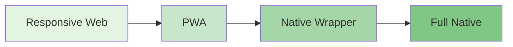

# Mobile App Strategy

**Created: 06-Jan-25**

## Table of Contents

1. [Overview](#overview)
2. [Progressive Enhancement Approach](#progressive-enhancement-approach)
3. [Phase 1: PWA Implementation](#phase-1-pwa-implementation)
4. [Phase 2: Native App Wrapper](#phase-2-native-app-wrapper)
5. [Phase 3: Full Native Experience](#phase-3-full-native-experience)
6. [Technology Stack](#technology-stack)
7. [Implementation Timeline](#implementation-timeline)
8. [Success Metrics](#success-metrics)

## Overview

The SaSarjan App Store mobile strategy follows a progressive enhancement approach, starting with a Progressive Web App (PWA) and evolving towards native mobile experiences based on user needs and platform maturity.

### Key Principles

1. **Mobile-First Design**: Every feature designed for mobile screens first
2. **Progressive Enhancement**: Start simple, add complexity as needed
3. **Cross-Platform Consistency**: Unified experience across all devices
4. **Offline-First**: Essential features work without internet
5. **Performance Optimized**: Fast loading and smooth interactions
6. **Accessibility**: WCAG 2.1 compliance on all platforms

## Progressive Enhancement Approach

### Why Progressive Enhancement?

- **Faster Time to Market**: Launch mobile experience immediately
- **Lower Initial Cost**: No app store fees or native development
- **Wider Reach**: Works on any device with a modern browser
- **Easier Updates**: Deploy updates instantly without app store review
- **User Choice**: Users can choose between web and native experiences

### Enhancement Stages



## Phase 1: PWA Implementation

### Core PWA Features

#### 1. **App Manifest**

```json
{
  "name": "SaSarjan App Store",
  "short_name": "SaSarjan",
  "description": "Collective Prosperity Platform",
  "start_url": "/",
  "display": "standalone",
  "background_color": "#ffffff",
  "theme_color": "#000000",
  "orientation": "portrait",
  "icons": [
    {
      "src": "/icon-192.png",
      "sizes": "192x192",
      "type": "image/png",
      "purpose": "any maskable"
    },
    {
      "src": "/icon-512.png",
      "sizes": "512x512",
      "type": "image/png",
      "purpose": "any maskable"
    }
  ],
  "categories": ["productivity", "social", "education"],
  "shortcuts": [
    {
      "name": "Browse Apps",
      "url": "/apps",
      "icon": "/shortcuts/apps.png"
    },
    {
      "name": "My Dashboard",
      "url": "/dashboard",
      "icon": "/shortcuts/dashboard.png"
    }
  ]
}
```

#### 2. **Service Worker Strategy**

```typescript
// Offline-first with network fallback
interface CacheStrategy {
  static: 'cache-first';      // App shell, CSS, JS
  api: 'network-first';       // API calls with cache fallback
  images: 'cache-first';      // App icons and static images
  userContent: 'network-only'; // User uploads, dynamic content
}

// Cache versioning
const CACHE_VERSION = 'v1.0.0';
const CACHE_NAMES = {
  static: `static-${CACHE_VERSION}`,
  api: `api-${CACHE_VERSION}`,
  images: `images-${CACHE_VERSION}`,
};
```

#### 3. **Offline Functionality**

- Browse previously viewed apps
- Access saved favorites
- Read cached content
- Queue actions for sync
- Show offline indicators

#### 4. **Mobile Optimizations**

```typescript
interface MobileOptimizations {
  // Touch gestures
  gestures: {
    swipeToRefresh: boolean;
    swipeNavigation: boolean;
    pinchToZoom: boolean;
  };

  // Performance
  performance: {
    lazyLoadImages: boolean;
    virtualScrolling: boolean;
    reducedMotion: boolean;
    adaptiveLoading: boolean;
  };

  // UI adaptations
  ui: {
    bottomNavigation: boolean;
    floatingActionButton: boolean;
    pullToRefresh: boolean;
    hapticFeedback: boolean;
  };
}
```

#### 5. **Push Notifications**

```typescript
interface NotificationStrategy {
  types: {
    appUpdates: boolean;
    newFeatures: boolean;
    developerNews: boolean;
    walletActivity: boolean;
    socialInteractions: boolean;
  };

  preferences: {
    quiet_hours: string[];
    frequency: 'instant' | 'hourly' | 'daily';
    channels: string[];
  };
}
```

### PWA Implementation Checklist

- [ ] Configure Next.js for PWA
- [ ] Create app manifest
- [ ] Implement service worker
- [ ] Add offline pages
- [ ] Set up push notifications
- [ ] Optimize for Lighthouse PWA audit
- [ ] Add install prompts
- [ ] Implement app shortcuts
- [ ] Add splash screens
- [ ] Configure status bar

## Phase 2: Native App Wrapper

### Technology: Capacitor

Capacitor provides the best balance of:

- Web view performance
- Native API access
- Code sharing with PWA
- Plugin ecosystem

### Native Features to Add

#### 1. **Enhanced Storage**

```typescript
interface NativeStorage {
  secureStorage: {
    wallet: EncryptedStorage;
    auth: BiometricProtectedStorage;
    preferences: LocalStorage;
  };

  fileSystem: {
    cache: FileSystemDirectory;
    documents: FileSystemDirectory;
    temp: FileSystemDirectory;
  };
}
```

#### 2. **Biometric Authentication**

- Face ID / Touch ID (iOS)
- Fingerprint / Face Unlock (Android)
- Fallback to PIN/Password

#### 3. **Native Share**

```typescript
interface NativeShare {
  shareApp(app: App): Promise<void>;
  shareStory(story: SuccessStory): Promise<void>;
  deepLink(content: Content): string;
}
```

#### 4. **Platform Integration**

- App shortcuts (3D Touch / Long press)
- Widget support
- Siri/Google Assistant shortcuts
- Native notifications
- Background sync

### Deployment Strategy

```yaml
platforms:
  ios:
    bundleId: com.sasarjan.appstore
    version: 1.0.0
    buildNumber: 1
    deployment:
      testflight: true
      appStore: true

  android:
    packageName: com.sasarjan.appstore
    versionCode: 1
    versionName: '1.0.0'
    deployment:
      internal: true
      beta: true
      production: true
```

## Phase 3: Full Native Experience

### When to Go Native?

Trigger points for native development:

- User base exceeds 100K active users
- Performance bottlenecks in web view
- Need for complex native features
- Platform-specific UI requirements
- Competitive advantages

### Native Architecture

```
┌─────────────────────────────────────┐
│         Shared Business Logic        │
│        (TypeScript/JavaScript)       │
├─────────────────┬───────────────────┤
│   React Native   │   Flutter/Kotlin  │
│   (Cross-platform)│   (Platform-specific)│
├─────────────────┴───────────────────┤
│          Native Modules              │
│    (Camera, AR, ML, Bluetooth)       │
└─────────────────────────────────────┘
```

### Feature Comparison

| Feature                | PWA     | Capacitor | Native |
| ---------------------- | ------- | --------- | ------ |
| Offline Support        | ✅      | ✅        | ✅     |
| Push Notifications     | ✅      | ✅        | ✅     |
| App Store Distribution | ❌      | ✅        | ✅     |
| Biometric Auth         | ❌      | ✅        | ✅     |
| Background Sync        | Limited | ✅        | ✅     |
| Native UI              | ❌      | Partial   | ✅     |
| AR/VR                  | Limited | Limited   | ✅     |
| Performance            | Good    | Better    | Best   |
| Development Cost       | Low     | Medium    | High   |

## Technology Stack

### Phase 1: PWA

```json
{
  "next-pwa": "^5.6.0",
  "workbox": "^7.0.0",
  "web-push": "^3.6.0"
}
```

### Phase 2: Capacitor

```json
{
  "@capacitor/core": "^5.0.0",
  "@capacitor/ios": "^5.0.0",
  "@capacitor/android": "^5.0.0",
  "@capacitor/filesystem": "^5.0.0",
  "@capacitor/push-notifications": "^5.0.0",
  "@capacitor/biometric-auth": "^5.0.0"
}
```

### Phase 3: Native Options

- **React Native**: For JavaScript expertise leverage
- **Flutter**: For high-performance cross-platform
- **Swift/Kotlin**: For platform-specific features

## Implementation Timeline

### Month 1: PWA Foundation

- Week 1: Service worker setup
- Week 2: Offline functionality
- Week 3: Push notifications
- Week 4: PWA optimization

### Month 2: Enhanced Mobile UX

- Week 1: Touch gestures
- Week 2: Mobile navigation
- Week 3: Performance optimization
- Week 4: User testing

### Month 3: Native Wrapper

- Week 1: Capacitor setup
- Week 2: Native features
- Week 3: App store preparation
- Week 4: Beta testing

### Month 4: Launch

- Week 1: App store submission
- Week 2: Marketing preparation
- Week 3: Soft launch
- Week 4: Full launch

## Success Metrics

### Technical Metrics

- Lighthouse PWA Score: >95
- Performance Score: >90
- Time to Interactive: <3s
- Offline functionality: 100%
- Crash rate: <0.1%

### User Metrics

- Install rate: >20%
- Daily active users: >40%
- Session duration: >5 min
- Retention (30 day): >25%
- App store rating: >4.5

### Business Metrics

- Mobile traffic share: >60%
- Mobile conversion rate: >3%
- Mobile revenue share: >50%
- Support tickets: <5%

## Implementation Guide

### 1. PWA Setup with Next.js

```typescript
// next.config.js
import withPWA from 'next-pwa';

const config = withPWA({
  dest: 'public',
  register: true,
  skipWaiting: true,
  disable: process.env.NODE_ENV === 'development',
  runtimeCaching: [
    {
      urlPattern: /^https:\/\/api\.sasarjan\.app\/.*/i,
      handler: 'NetworkFirst',
      options: {
        cacheName: 'api-cache',
        expiration: {
          maxEntries: 10,
          maxAgeSeconds: 60 * 60 * 24 // 24 hours
        }
      }
    }
  ]
});
```

### 2. Mobile-First Components

```typescript
// components/MobileNav.tsx
export const MobileNav = () => {
  const [activeTab, setActiveTab] = useState('home');

  return (
    <nav className="fixed bottom-0 left-0 right-0 bg-background border-t md:hidden">
      <div className="flex justify-around py-2">
        <TabButton icon={Home} label="Home" active={activeTab === 'home'} />
        <TabButton icon={Search} label="Browse" active={activeTab === 'browse'} />
        <TabButton icon={Plus} label="Create" active={activeTab === 'create'} />
        <TabButton icon={User} label="Profile" active={activeTab === 'profile'} />
      </div>
    </nav>
  );
};
```

### 3. Offline Detection

```typescript
// hooks/useOffline.ts
export const useOffline = () => {
  const [isOffline, setIsOffline] = useState(!navigator.onLine);

  useEffect(() => {
    const handleOnline = () => setIsOffline(false);
    const handleOffline = () => setIsOffline(true);

    window.addEventListener('online', handleOnline);
    window.addEventListener('offline', handleOffline);

    return () => {
      window.removeEventListener('online', handleOnline);
      window.removeEventListener('offline', handleOffline);
    };
  }, []);

  return isOffline;
};
```

## Testing Strategy

### PWA Testing

- Chrome DevTools PWA audit
- Offline testing scenarios
- Push notification testing
- Installation flow testing

### Mobile Testing

- Device testing lab
- Browser stack testing
- Performance profiling
- Accessibility testing

### User Testing

- Beta testing program
- A/B testing features
- User feedback loops
- Analytics tracking

---

**Document Version**: 1.0  
**Last Updated**: 06-Jan-25  
**Next Review**: 13-Jan-25
