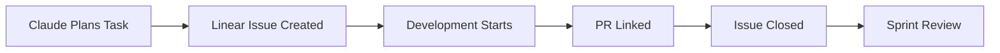
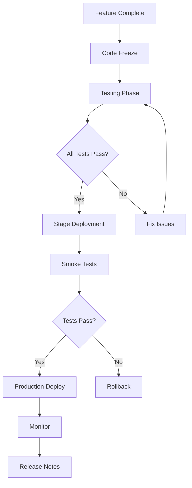

# Project Management Guide for SaSarjan App Store

**Created: 03-Jul-25**

## Table of Contents

1. [Project Management Philosophy](#project-management-philosophy)
2. [Recommended Tools](#recommended-tools)
3. [Sprint Planning with Claude](#sprint-planning-with-claude)
4. [Daily Workflow](#daily-workflow)
5. [Task Management](#task-management)
6. [Progress Tracking](#progress-tracking)
7. [Team Collaboration](#team-collaboration)
8. [Risk Management](#risk-management)
9. [Release Management](#release-management)

## Project Management Philosophy

### Agile Methodology with AI Assistance

- **2-week sprints** with clear deliverables
- **Daily Claude reviews** for progress tracking
- **Weekly architecture reviews** with Claude
- **Continuous integration** and deployment
- **Documentation-driven development**

### Key Principles

1. **Transparency**: All progress visible in project tools
2. **Automation**: Use Claude for repetitive tasks
3. **Quality**: Built-in testing and reviews
4. **Flexibility**: Adapt based on learnings
5. **Communication**: Clear documentation and updates

## Recommended Tools

### 1. **Linear (Primary Recommendation)**

#### Why Linear?

- Clean, fast interface
- Excellent API for Claude integration
- Built for engineering teams
- Keyboard shortcuts align with Claude
- Real-time collaboration

#### Linear Setup

```javascript
// Linear Integration for Claude
const linearClient = new LinearClient({
  apiKey: process.env.LINEAR_API_KEY
});

// Automated issue creation from Claude
async function createIssueFromClaude(task) {
  return await linearClient.issueCreate({
    title: task.title,
    description: task.description,
    projectId: "APPSTORE",
    estimate: task.estimate,
    labels: ["claude-generated"]
  });
}
```

#### Linear Workflow



### 2. **GitHub Projects (Alternative)**

#### GitHub Projects Setup

```yaml
# .github/workflows/project-automation.yml
name: Project Automation
on:
  issues:
    types: [opened, closed]
  pull_request:
    types: [opened, closed]

jobs:
  automate:
    runs-on: ubuntu-latest
    steps:
      - uses: actions/github-script@v6
        with:
          script: |
            // Automatically add issues to project
            // Link PRs to issues
            // Update status based on PR state
```

### 3. **Notion (Documentation & Planning)**

#### Notion Structure

```
SaSarjan App Store/
├── 📋 Project Overview
├── 🏗️ Architecture
│   ├── System Design
│   ├── Database Schema
│   └── API Documentation
├── 📅 Sprint Planning
│   ├── Current Sprint
│   ├── Backlog
│   └── Completed Sprints
├── 📚 Knowledge Base
│   ├── Technical Decisions
│   ├── Meeting Notes
│   └── Research
├── 🚀 Release Notes
└── 📊 Analytics & Reports
```

### 4. **Additional Tools**

#### Excalidraw (Architecture Diagrams)

- Real-time collaborative diagrams
- Version control friendly
- Claude can describe diagrams

#### Figma (UI/UX Design)

- Component library
- Design system
- Developer handoff

#### PostHog (Analytics)

- Product analytics
- Feature flags
- Session recording

## Sprint Planning with Claude

### Sprint Planning Template

````markdown
# Sprint X Planning (Date Range)

## Sprint Goal

[Clear, achievable goal for this sprint]

## Claude-Assisted Planning Session

```bash
claude --plan "Plan sprint X focusing on [main features]"
```
````

## User Stories

1. As a [developer], I want to [submit apps] so that [users can download them]
   - Acceptance Criteria
   - Technical Tasks
   - Estimate: X days

## Technical Tasks

- [ ] Task 1 (2 days)
- [ ] Task 2 (1 day)
- [ ] Task 3 (3 days)

## Dependencies

- External API availability
- Design completion
- Third-party library updates

## Risks

- Risk 1: Mitigation strategy
- Risk 2: Mitigation strategy

````

### Sprint Kickoff Checklist

```markdown
## Sprint Kickoff Checklist
- [ ] Previous sprint retrospective completed
- [ ] Sprint goal defined and agreed
- [ ] All stories estimated
- [ ] Dependencies identified
- [ ] Claude context updated (CLAUDE.md)
- [ ] Team capacity confirmed
- [ ] Technical debt allocated (20%)
````

## Daily Workflow

### Morning Routine (9:00 AM IST)

```bash
# 1. Check project status
claude --chat "Show me the current project status and today's priorities"

# 2. Review yesterday's progress
git log --since=yesterday --oneline
claude --chat "Review these commits and suggest improvements"

# 3. Plan today's work
claude --chat "Based on the sprint goals, what should I focus on today?"
```

### During Development

```bash
# Feature development
claude --chat "Implement [feature] following our architecture"

# Code review
claude --chat "Review this code for security and performance"

# Problem solving
claude --plan "How should we handle [complex problem]?"
```

### End of Day (6:00 PM IST)

```bash
# 1. Commit all changes
git add . && git commit -m "feat: [description]"

# 2. Update task status
claude --chat "Update Linear with today's progress"

# 3. Plan tomorrow
claude --chat "What should be the priority for tomorrow?"
```

## Task Management

### Task Hierarchy

```
Epic (Quarter)
└── Feature (Sprint)
    └── Story (Days)
        └── Task (Hours)
            └── Subtask (Minutes)
```

### Task Template

````markdown
## Task: [Name]

### Description

[What needs to be done]

### Acceptance Criteria

- [ ] Criteria 1
- [ ] Criteria 2
- [ ] Tests written

### Technical Details

- Dependencies: [List]
- Estimated Time: [X hours]
- Assigned To: [Name]

### Claude Commands

```bash
# Implementation
claude --chat "Implement [specific part]"

# Testing
claude --chat "Write tests for [feature]"
```
````

### Notes

[Any additional context]

````

### Task States

```mermaid
stateDiagram-v2
    [*] --> Backlog
    Backlog --> ToDo: Sprint Planning
    ToDo --> InProgress: Developer Starts
    InProgress --> Review: PR Created
    Review --> Testing: Code Approved
    Testing --> Done: Tests Pass
    Testing --> InProgress: Tests Fail
    Review --> InProgress: Changes Requested
    Done --> [*]
````

## Progress Tracking

### Daily Metrics

```typescript
interface DailyMetrics {
  tasksCompleted: number;
  linesOfCode: number;
  testsWritten: number;
  documentationUpdated: boolean;
  blockers: string[];
  tomorrowPriorities: string[];
}

// Track in Linear/GitHub
async function updateDailyMetrics(metrics: DailyMetrics) {
  await linearClient.commentCreate({
    issueId: currentSprintId,
    body: formatMetricsReport(metrics)
  });
}
```

### Weekly Reports

```markdown
# Week X Progress Report

## Completed

- ✅ Feature 1: [Description]
- ✅ Feature 2: [Description]
- ✅ Bug fixes: [Count]

## In Progress

- 🔄 Feature 3: 70% complete
- 🔄 Feature 4: Just started

## Blockers

- 🚫 Waiting for API documentation
- 🚫 Performance issue in service X

## Next Week

- Priority 1: Complete Feature 3
- Priority 2: Start Feature 5
- Priority 3: Performance optimization

## Metrics

- Story Points Completed: X/Y
- Test Coverage: X%
- Documentation Updated: Yes/No
```

### Sprint Burndown

```javascript
// Generate burndown data
function generateBurndown(sprint) {
  const days = [];
  let remaining = sprint.totalPoints;

  sprint.days.forEach(day => {
    remaining -= day.pointsCompleted;
    days.push({
      date: day.date,
      remaining: remaining,
      ideal: calculateIdealBurndown(day.index)
    });
  });

  return days;
}
```

## Team Collaboration

### Communication Channels

```yaml
channels:
  daily_standup:
    time: '10:00 AM IST'
    duration: '15 minutes'
    format: "What I did, What I'll do, Blockers"

  code_review:
    tool: 'GitHub PRs'
    sla: '4 hours'
    checklist: 'See PR template'

  architecture_discussion:
    frequency: 'Weekly'
    day: 'Wednesday'
    participants: 'All developers'

  sprint_planning:
    frequency: 'Bi-weekly'
    day: 'Monday'
    duration: '2 hours'
```

### Collaboration with Claude

```bash
# Pair programming
claude --chat "Let's implement the wallet service together"

# Architecture review
claude --chat "Review this architecture for scalability"

# Documentation
claude --chat "Generate API documentation for this service"

# Code review
claude --chat "Review this PR for best practices"
```

### Knowledge Sharing

```markdown
## Weekly Tech Talk Topics

- Week 1: Supabase RLS best practices
- Week 2: Razorpay integration patterns
- Week 3: Form builder architecture
- Week 4: Security considerations

## Documentation Standards

- Every PR must update relevant docs
- API changes require OpenAPI updates
- New features need user guides
- Architecture decisions in ADR format
```

## Risk Management

### Risk Register

```markdown
# Project Risk Register

## High Priority Risks

1. **Third-party API Changes**
   - Probability: Medium
   - Impact: High
   - Mitigation: Version pinning, abstraction layer
   - Owner: Backend Team

2. **Performance at Scale**
   - Probability: High
   - Impact: Medium
   - Mitigation: Load testing, caching strategy
   - Owner: DevOps Team

## Risk Assessment Matrix
```

### Risk Mitigation Strategies

```typescript
interface RiskMitigation {
  automated_testing: {
    coverage_target: 80,
    types: ['unit', 'integration', 'e2e']
  },
  security_scanning: {
    frequency: 'daily',
    tools: ['npm audit', 'OWASP scan']
  },
  performance_monitoring: {
    tools: ['Sentry', 'Prometheus'],
    alerts: true
  },
  backup_strategy: {
    frequency: 'hourly',
    retention: '30 days'
  }
}
```

## Release Management

### Release Process



### Release Checklist

```markdown
## Release Checklist v[X.Y.Z]

### Pre-release

- [ ] All features complete and tested
- [ ] Security scan passed
- [ ] Performance benchmarks met
- [ ] Documentation updated
- [ ] Release notes drafted

### Release

- [ ] Database migrations tested
- [ ] Environment variables updated
- [ ] Feature flags configured
- [ ] Monitoring alerts set up
- [ ] Rollback plan ready

### Post-release

- [ ] Smoke tests passed
- [ ] Key metrics normal
- [ ] User communications sent
- [ ] Team retrospective scheduled
- [ ] Next sprint planned
```

### Version Naming

```
Major.Minor.Patch-Tag

1.0.0 - Initial release
1.1.0 - New features
1.1.1 - Bug fixes
2.0.0 - Breaking changes

Tags: alpha, beta, rc, stable
```

## Automation Scripts

### Daily Automation

```bash
#!/bin/bash
# daily-update.sh

echo "🚀 Starting daily update..."

# Update Linear/GitHub
claude --chat "Update all task statuses based on git commits"

# Generate daily report
claude --chat "Generate daily progress report"

# Check for blockers
claude --chat "Identify any blockers from today's work"

# Plan tomorrow
claude --chat "Create tomorrow's task list based on sprint goals"

echo "✅ Daily update complete!"
```

### Sprint Automation

```javascript
// sprint-automation.js
const automation = {
  startSprint: async (sprintNumber) => {
    // Create sprint in Linear
    // Generate sprint documentation
    // Set up monitoring dashboards
    // Create sprint branch
    // Update CLAUDE.md
  },

  endSprint: async (sprintNumber) => {
    // Generate sprint report
    // Create release notes
    // Archive completed tasks
    // Calculate velocity
    // Plan retrospective
  }
};
```

## Success Metrics

### Project KPIs

```typescript
interface ProjectKPIs {
  velocity: {
    target: 40, // story points per sprint
    measure: 'completed_points / sprint_days'
  },
  quality: {
    bug_rate: '< 5 per sprint',
    test_coverage: '> 80%',
    code_review_time: '< 4 hours'
  },
  delivery: {
    on_time_delivery: '> 90%',
    scope_creep: '< 10%',
    customer_satisfaction: '> 4.5/5'
  }
}
```

### Dashboard Configuration

```yaml
# monitoring-dashboard.yaml
dashboards:
  development:
    - commits_per_day
    - pr_merge_time
    - test_coverage_trend
    - bug_discovery_rate

  business:
    - features_delivered
    - sprint_velocity
    - release_frequency
    - user_adoption_rate
```

---

**Document Version**: 1.2  
**Last Updated**: 03-Jul-25  
**Related Documents**:

- [Architecture Plan](./AppStore_Architecture_Plan_03-Jul-25.md)
- [Claude Integration](./Claude_MCP_Integration_Strategy.md)
- [Development Workflow](./Development_Workflow.md)
