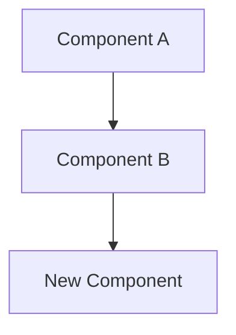

# Technical Architecture Decision Record (ADR) Template

**Use this template for**: Technical and architectural decisions that affect system design, technology choices, or development patterns

---

## ADR-XXX: [Decision Title]

**Date**: DD-MMM-YYYY  
**Status**: PROPOSED | ACCEPTED | DEPRECATED | SUPERSEDED by ADR-YYY  
**Deciders**: [List of people involved in decision]  
**Technical Story**: [Link to issue/story if applicable]

### Context

#### Problem Statement

[What is the technical challenge we're facing?]

#### Current State

[How are things working now? What are the pain points?]

#### Requirements

- Functional: [What must the solution do?]
- Non-functional: [Performance, security, scalability needs]
- Constraints: [Budget, time, technology limitations]

#### Assumptions

- [Assumption 1]
- [Assumption 2]

### Decision

#### Chosen Solution

[Clear statement of the technical decision made]

#### Implementation Details

```typescript
// Code example if applicable
interface Example {
  // Show key interfaces or patterns
}
```

#### Architecture Impact



### Alternatives Considered

#### Alternative 1: [Name]

- **Description**: [What is this approach?]
- **Pros**:
  - [Advantage 1]
  - [Advantage 2]
- **Cons**:
  - [Disadvantage 1]
  - [Disadvantage 2]
- **Rejection Reason**: [Why wasn't this chosen?]

#### Alternative 2: [Name]

[Repeat structure]

### Consequences

#### Positive

- 🎯 [Immediate benefit]
- 📈 [Long-term advantage]
- 🔧 [Technical improvement]

#### Negative

- ⚠️ [Known limitation]
- 🔄 [Required changes]
- 📚 [Learning curve]

#### Neutral

- 🔄 [Side effects that aren't good or bad]
- 📋 [Process changes required]

### Technical Debt

- **Debt Created**: [What shortcuts are we taking?]
- **Debt Removed**: [What issues does this resolve?]
- **Future Considerations**: [What might need revisiting?]

### Implementation Checklist

#### Prerequisites

- [ ] [Required setup or dependencies]
- [ ] [Team training needed]
- [ ] [Infrastructure changes]

#### Implementation Steps

1. [ ] [Step 1 with estimated time]
2. [ ] [Step 2 with estimated time]
3. [ ] [Step 3 with estimated time]

#### Validation

- [ ] Unit tests covering [areas]
- [ ] Integration tests for [scenarios]
- [ ] Performance benchmarks showing [metrics]
- [ ] Security scan results

### Migration Strategy

[If replacing existing solution]

- **Phase 1**: [Parallel running]
- **Phase 2**: [Gradual migration]
- **Phase 3**: [Deprecation of old system]
- **Rollback Plan**: [How to revert if needed]

### Monitoring and Success Metrics

#### Technical Metrics

- Response time: [Current] → [Target]
- Error rate: [Current] → [Target]
- Resource usage: [Current] → [Target]

#### Business Metrics

- Development velocity impact
- Maintenance effort change
- User experience improvements

### Documentation Updates Required

- [ ] API documentation
- [ ] Architecture diagrams
- [ ] Developer guides
- [ ] Runbooks

### Security Considerations

- **Data Security**: [Impact on data protection]
- **Access Control**: [Changes to permissions]
- **Compliance**: [Regulatory considerations]

### References

- [Link to RFC or design doc]
- [Link to proof of concept]
- [Link to benchmark results]
- [External documentation]

---

### Decision Log

| Date       | Status Change | Notes                    |
| ---------- | ------------- | ------------------------ |
| DD-MM-YYYY | Proposed      | Initial draft            |
| DD-MM-YYYY | Accepted      | Approved by tech lead    |
| DD-MM-YYYY | Implemented   | Rolled out to production |

### Related Decisions

- Depends on: [ADR-XXX]
- Influences: [ADR-YYY]
- Supersedes: [ADR-ZZZ]
