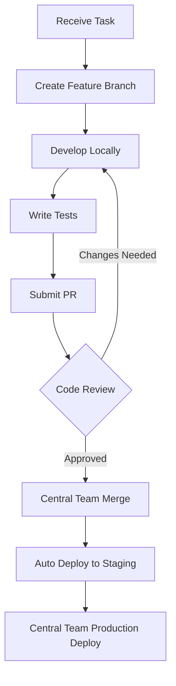

# Developer Role Definition & Boundaries

**Purpose**: Clear definition of developer responsibilities, permissions, and boundaries  
**Last Updated**: 07-Jul-2025, Monday 09:10 IST  
**Version**: 1.0

## 👨‍💻 Developer Role Overview

### Primary Responsibility

Build high-quality, location-aware micro-apps that contribute to the SaSarjan ecosystem while following established patterns and maintaining code quality standards.

### Team Structure

- **Junior Developers**: 1-2 years experience, work on assigned features
- **Senior Developers**: 3+ years experience, lead feature development
- **Module Developers**: External contributors building standalone modules
- **App Team Leads**: Coordinate specific app development (TalentExcel, SevaPremi, etc.)

## ✅ What Developers CAN Do Independently

### 1. Code Development

- ✓ Create new features within assigned app boundaries
- ✓ Implement UI components following design system
- ✓ Write API routes for app-specific functionality
- ✓ Add database queries using existing schemas
- ✓ Implement location-aware features
- ✓ Create and manage feature branches
- ✓ Write unit and integration tests
- ✓ Fix bugs in their code areas
- ✓ Optimize performance within their features

### 2. Local Development

- ✓ Run development servers locally
- ✓ Use development database credentials
- ✓ Create test data for development
- ✓ Install npm packages for their app
- ✓ Configure IDE and development tools
- ✓ Run tests and linting locally

### 3. Documentation

- ✓ Write code comments and JSDoc
- ✓ Update feature documentation
- ✓ Create API documentation
- ✓ Document component usage
- ✓ Write test scenarios

### 4. Collaboration

- ✓ Create pull requests for features
- ✓ Review code from peers (junior level)
- ✓ Participate in daily standups
- ✓ Ask questions in team channels
- ✓ Report bugs and issues
- ✓ Suggest improvements

## 🚫 What Requires Central Team Approval

### 1. Architecture Changes

- ❌ Modifying database schemas
- ❌ Changing authentication flow
- ❌ Altering core infrastructure
- ❌ Adding new microservices
- ❌ Changing build configuration
- ❌ Modifying CI/CD pipelines

### 2. Security & Access

- ❌ Adding new environment variables
- ❌ Accessing production database
- ❌ Modifying security policies
- ❌ Changing CORS settings
- ❌ Adding external API integrations
- ❌ Handling payment data

### 3. Dependencies

- ❌ Adding major new dependencies
- ❌ Upgrading framework versions
- ❌ Changing core packages
- ❌ Adding external services
- ❌ Modifying build tools

### 4. Deployment

- ❌ Deploying to production
- ❌ Modifying deployment configs
- ❌ Accessing production logs
- ❌ Changing domain settings
- ❌ Configuring CDN

## 📋 Developer Workflow & Boundaries

### Feature Development Process



### Code Ownership Model

```typescript
// Developer owns their feature code
apps/talentexcel/
  ├── features/
  │   ├── internships/        ✓ Full ownership
  │   ├── fellowships/        ✓ Full ownership
  │   └── mentorship/         ✓ Full ownership
  ├── components/             ✓ Can create/modify
  ├── api/                    ✓ Can create routes
  └── lib/                    ⚠️ Use existing utilities

// Central Team owns core infrastructure
packages/
  ├── auth/                   ❌ Read-only
  ├── database/               ❌ Read-only
  ├── ui/                     ⚠️ Can use, not modify
  └── shared/                 ❌ Read-only
```

## 🔒 Security Boundaries

### What Developers Should NEVER Do

1. **Never commit secrets** - Use environment variables
2. **Never log sensitive data** - PII, passwords, tokens
3. **Never bypass auth checks** - Always validate permissions
4. **Never access other apps' data** - Stay within boundaries
5. **Never modify RLS policies** - Request from Central Team
6. **Never share credentials** - Each dev has own access

### Security Checklist for PRs

- [ ] No hardcoded secrets or API keys
- [ ] All user inputs are validated
- [ ] SQL queries use parameterization
- [ ] API routes check authentication
- [ ] Sensitive data is not logged
- [ ] CORS is properly configured
- [ ] File uploads are validated
- [ ] Rate limiting is implemented

## 🧪 Testing Responsibilities

### Developer Must Test

1. **Unit Tests**
   - All utility functions
   - Component rendering
   - State management
   - Business logic

2. **Integration Tests**
   - API route functionality
   - Database operations
   - Component interactions
   - Form submissions

3. **Manual Testing**
   - Feature works as expected
   - Mobile responsiveness
   - Cross-browser compatibility
   - Error scenarios
   - Loading states

### Central Team Tests

1. **Security Testing**
   - Penetration testing
   - Auth flow validation
   - Data access controls

2. **Performance Testing**
   - Load testing
   - Bundle size analysis
   - Database query optimization

3. **E2E Testing**
   - Full user journeys
   - Payment flows
   - Cross-app integration

## 📊 Performance Guidelines

### Developer Responsibilities

- Keep bundle size under 100KB per feature
- Optimize images (use next/image)
- Implement lazy loading
- Add loading states
- Cache API responses appropriately
- Minimize re-renders

### Performance Checklist

```typescript
// Before submitting PR, ensure:
- [ ] No N+1 queries
- [ ] Images are optimized
- [ ] Components are memoized where needed
- [ ] API calls are debounced/throttled
- [ ] Large lists use virtualization
- [ ] Animations use CSS/GPU
```

## 🔄 Code Review Process

### Self-Review Checklist

Before submitting PR, developers must:

- [ ] Code follows style guide
- [ ] All tests pass
- [ ] No console.logs in production code
- [ ] TypeScript has no errors
- [ ] Documentation is updated
- [ ] PR description is complete
- [ ] Screenshots added (for UI changes)

### Peer Review (Junior Developers)

Can review for:

- ✓ Code readability
- ✓ Business logic correctness
- ✓ UI/UX consistency
- ✓ Test coverage

### Central Team Review

Must review for:

- ✓ Security implications
- ✓ Performance impact
- ✓ Architecture alignment
- ✓ Database efficiency
- ✓ Deployment readiness

## 🚀 Deployment Permissions

### Developer Can

- ✓ Deploy to personal preview branches
- ✓ View staging deployments
- ✓ Access deployment previews
- ✓ View build logs

### Developer Cannot

- ❌ Deploy to production
- ❌ Access production database
- ❌ Modify environment variables
- ❌ View production logs
- ❌ Change deployment settings

### Deployment Flow

```
Developer PR → Auto Preview → Code Review → Merge to Main → Auto Staging → Central Team → Production
```

## 📈 Success Metrics

### Individual Developer Metrics

1. **Code Quality**
   - PR approval rate > 80% first attempt
   - Test coverage > 80%
   - Zero security violations
   - TypeScript compliance 100%

2. **Productivity**
   - 3-5 PRs per week
   - < 2 day PR turnaround
   - Features completed on time
   - Bug fix rate < 10%

3. **Collaboration**
   - Participates in reviews
   - Helps other developers
   - Documents thoroughly
   - Communicates blockers

### Team Success Metrics

1. **Delivery**
   - Sprint goals achieved > 90%
   - Feature delivery on schedule
   - Production bugs < 5 per sprint

2. **Quality**
   - Lighthouse score > 90
   - Zero security incidents
   - 99.9% uptime

## 🆘 Escalation Matrix

### When to Escalate to Central Team

| Issue Type             | When to Escalate      | Contact       |
| ---------------------- | --------------------- | ------------- |
| Blocked by permissions | Immediately           | Tech Lead     |
| Architecture question  | After team discussion | Senior Dev    |
| Security concern       | Immediately           | Security Lead |
| Performance issue      | After profiling       | Tech Lead     |
| Deployment problem     | After checking logs   | DevOps        |
| Database issue         | After query analysis  | DBA           |

### How to Escalate

1. Try to solve within team first
2. Document what you've tried
3. Prepare specific questions
4. Use appropriate channel
5. Tag relevant person
6. Provide context and urgency

## 📚 Resources

### For Developers

- [Code Style Guide](./code-standards.md)
- [Testing Guide](./testing-guide.md)
- [API Conventions](./api-conventions.md)
- [Component Library](https://ui.sasarjan.com)

### For Questions

- Technical: #dev-help
- Security: #security-concerns
- Architecture: #architecture-decisions
- Emergency: @oncall-engineer

---

Remember: **Your role is to build amazing features while maintaining quality and security. When in doubt, ask!**
