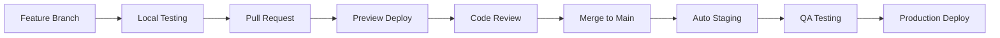
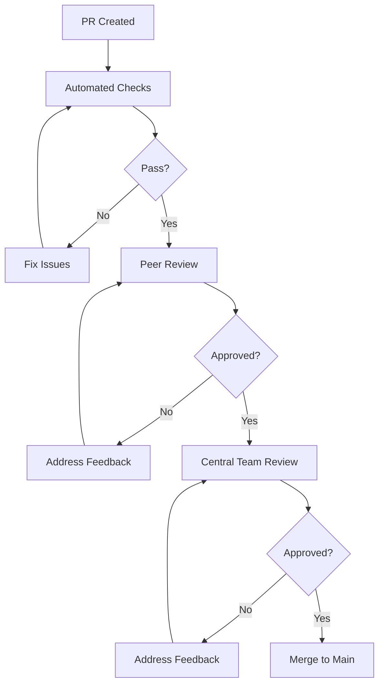

# Integration & Deployment Guide

**Purpose**: Define the complete process from feature development to production deployment  
**Last Updated**: 07-Jul-2025, Monday 09:25 IST  
**Version**: 1.0

## 🔄 Development Lifecycle Overview



## 🌿 Branch Strategy

### Branch Naming Convention

```bash
feature/[app-name]-[feature-description]
fix/[app-name]-[bug-description]
docs/[documentation-update]
test/[test-description]
refactor/[refactor-description]

# Examples:
feature/talentexcel-location-search
fix/talentexcel-application-form-validation
docs/location-aware-guide
test/internship-api-coverage
refactor/shared-components-optimization
```

### Branch Lifecycle

```bash
# 1. Create feature branch from main
git checkout main
git pull origin main
git checkout -b feature/talentexcel-internship-filters

# 2. Regular commits during development
git add .
git commit -m "feat: add skill-based filtering to internship search"

# 3. Keep branch updated with main
git fetch origin
git rebase origin/main

# 4. Push to remote
git push origin feature/talentexcel-internship-filters
```

### Commit Message Format

```
type(scope): description

[optional body]

[optional footer]

Types:
- feat: New feature
- fix: Bug fix
- docs: Documentation
- style: Formatting
- refactor: Code restructuring
- test: Testing
- chore: Maintenance

Example:
feat(talentexcel): add location-based internship search

- Implemented PostGIS geographic queries
- Added distance calculation from user location
- Created location picker component
- Added proper loading and error states

Fixes #123
```

## 📤 Pull Request Process

### PR Creation Checklist

```markdown
## PR Title Format

[App] Type: Brief description
Example: [TalentExcel] Feature: Location-based internship search

## PR Template

### 🎯 What does this PR do?

Brief description of changes and why they're needed

### 🖼️ Screenshots/Demo

[Add screenshots for UI changes]
[Add Loom video for complex features]

### ✅ Testing Checklist

- [ ] Tested locally on development server
- [ ] Tested on mobile responsive view
- [ ] Unit tests written and passing
- [ ] Integration tests added
- [ ] No console errors or warnings
- [ ] Accessibility checked (keyboard nav, screen reader)

### 🔍 Code Quality

- [ ] TypeScript has no errors (`pnpm typecheck`)
- [ ] Linting passes (`pnpm lint`)
- [ ] No hardcoded values or secrets
- [ ] Proper error handling added
- [ ] Loading states implemented
- [ ] Comments added for complex logic

### 📦 Dependencies

- [ ] No new dependencies added
- [ ] If added, justified in PR description
- [ ] Bundle size impact checked

### 🔗 Related Issues

Fixes #[issue-number]
Relates to #[issue-number]

### 🚨 Breaking Changes

[List any breaking changes]

### 📝 Documentation

- [ ] README updated if needed
- [ ] API documentation updated
- [ ] Component documentation added
- [ ] Changelog entry added

### 🎭 Preview URL

[Automatic preview URL will appear here]

### 💭 Notes for Reviewers

[Any specific areas to focus on]
[Known issues or future improvements]
```

### PR Size Guidelines

- **Small PR**: < 200 lines (preferred)
- **Medium PR**: 200-500 lines (acceptable)
- **Large PR**: > 500 lines (requires justification)

Break large features into multiple PRs:

1. Database schema/API
2. UI components
3. Integration
4. Tests and documentation

## 🔍 Code Review Process

### Review Stages



### Automated Checks (Must Pass)

```yaml
# .github/workflows/pr-checks.yml
- TypeScript compilation
- ESLint (no errors)
- Prettier formatting
- Unit tests (>80% coverage)
- Build verification
- Bundle size check
- Lighthouse CI (performance)
```

### Peer Review Focus

- Code readability and clarity
- Business logic correctness
- UI/UX consistency
- Test coverage
- Documentation completeness

### Central Team Review Focus

- Security implications
- Performance impact
- Database query efficiency
- Architecture alignment
- Production readiness
- Scalability concerns

### Review Response SLA

- **Peer Review**: Within 4 hours
- **Central Team Review**: Within 8 hours
- **Critical Fixes**: Within 1 hour

## 🚀 Deployment Pipeline

### Environment Flow

```
Local → Feature Preview → Main Preview → Staging → Production
```

### 1. Feature Preview (Automatic)

```yaml
Trigger: Push to feature branch
Platform: Vercel
URL: https://[branch-name]-sasarjan.vercel.app
Duration: Lifetime of PR
Access: Public (password protected for sensitive features)
```

### 2. Main Preview (Automatic)

```yaml
Trigger: Merge to main branch
Platform: Vercel
URL: https://preview-sasarjan.vercel.app
Duration: Permanent
Access: Team only
Purpose: Integration testing
```

### 3. Staging Environment

```yaml
Trigger: Automatic from main (daily at 2 AM IST)
Platform: Vercel
URL: https://staging-sasarjan.com
Database: Staging database (copy of production)
Duration: Permanent
Access: Team + selected testers
Purpose: Final QA before production
```

### 4. Production Deployment

```yaml
Trigger: Manual by Central Team
Platform: Vercel
URL: https://sasarjan.com
Database: Production
Approval: Required from 2 Central Team members
Rollback: Automatic on errors
```

### Deployment Configuration

```javascript
// vercel.json
{
  "github": {
    "enabled": true,
    "autoAlias": true
  },
  "buildCommand": "pnpm build",
  "devCommand": "pnpm dev",
  "installCommand": "pnpm install",
  "framework": "nextjs",
  "regions": ["bom1"], // Mumbai region
  "functions": {
    "app/api/**.ts": {
      "maxDuration": 30
    }
  }
}
```

## 🧪 Testing Requirements

### Pre-Merge Testing

```bash
# Run locally before creating PR
pnpm test:all

# This runs:
- pnpm typecheck    # TypeScript validation
- pnpm lint         # Code quality
- pnpm test:unit    # Unit tests
- pnpm test:integration # API tests
- pnpm build        # Build verification
```

### Staging Testing Checklist

- [ ] Feature works as expected
- [ ] No regression in existing features
- [ ] Performance metrics acceptable
- [ ] Mobile responsive verified
- [ ] Cross-browser testing done
- [ ] Accessibility standards met
- [ ] Location features work correctly
- [ ] Tag filtering performs well
- [ ] User journey is smooth

### Production Smoke Tests

```typescript
// Post-deployment verification
- Health check endpoints responding
- Database connections active
- Third-party integrations working
- Critical user flows functional
- Monitoring alerts configured
- Error tracking active
```

## 📊 Monitoring & Rollback

### Deployment Monitoring

```yaml
Metrics to Track:
  - Build time < 5 minutes
  - Deployment time < 2 minutes
  - First paint < 2 seconds
  - API response time < 200ms
  - Error rate < 0.1%
  - Uptime > 99.9%
```

### Automatic Rollback Triggers

- Build failure
- Health check failure (3 consecutive)
- Error rate > 5%
- Response time > 1 second (p95)
- Memory usage > 90%

### Manual Rollback Process

```bash
# Central Team only
vercel rollback --scope sasarjan

# Or using GitHub
# Revert the merge commit
git revert -m 1 <merge-commit-hash>
git push origin main
```

## 🔒 Security Checks

### Pre-Deployment Security

1. **Dependency Scanning**

   ```bash
   pnpm audit
   # Must have 0 high/critical vulnerabilities
   ```

2. **Secret Scanning**

   ```bash
   # Automated via GitHub
   # Blocks PR if secrets detected
   ```

3. **OWASP Top 10 Check**
   - SQL Injection prevention
   - XSS protection
   - CSRF tokens
   - Secure headers
   - Input validation

### Production Security Headers

```typescript
// next.config.js security headers
{
  'X-Frame-Options': 'DENY',
  'X-Content-Type-Options': 'nosniff',
  'X-XSS-Protection': '1; mode=block',
  'Referrer-Policy': 'strict-origin-when-cross-origin',
  'Content-Security-Policy': "default-src 'self'",
  'Strict-Transport-Security': 'max-age=31536000'
}
```

## 🚨 Incident Response

### Severity Levels

1. **SEV-1**: Complete outage
2. **SEV-2**: Major feature broken
3. **SEV-3**: Minor feature issue
4. **SEV-4**: Cosmetic issue

### Response Times

- **SEV-1**: 15 minutes
- **SEV-2**: 1 hour
- **SEV-3**: 4 hours
- **SEV-4**: Next sprint

### Incident Process

1. Detect (monitoring/user report)
2. Assess severity
3. Page on-call if SEV-1/2
4. Create incident channel
5. Investigate and fix
6. Deploy hotfix
7. Post-mortem (SEV-1/2)

## 📋 Deployment Checklist

### Developer Checklist (Before PR)

- [ ] Feature complete and tested locally
- [ ] All tests passing
- [ ] No console.logs in code
- [ ] Environment variables documented
- [ ] Database migrations tested
- [ ] API documentation updated
- [ ] Performance impact assessed

### Reviewer Checklist

- [ ] Code follows patterns
- [ ] Security best practices
- [ ] Error handling complete
- [ ] Tests are comprehensive
- [ ] Documentation accurate
- [ ] No breaking changes

### Central Team Checklist (Before Production)

- [ ] Staging testing complete
- [ ] Performance acceptable
- [ ] Security scan passed
- [ ] Rollback plan ready
- [ ] Monitoring configured
- [ ] Team notified

## 🎯 Best Practices

### DO ✅

- Keep PRs small and focused
- Test thoroughly before PR
- Respond to reviews quickly
- Document breaking changes
- Use feature flags for big changes
- Monitor after deployment

### DON'T ❌

- Push directly to main
- Merge without reviews
- Deploy on Fridays
- Ignore failing tests
- Skip documentation
- Bypass security checks

## 📞 Deployment Contacts

### Escalation Path

1. **Build Issues**: #dev-help channel
2. **Review Delays**: Team Lead DM
3. **Production Issues**: @oncall-engineer
4. **Security Concerns**: security@sasarjan.com

### On-Call Schedule

- Weekdays: Central Team rotation
- Weekends: Senior developer rotation
- Holidays: Pre-assigned coverage

---

Remember: **Every deployment affects real users. Take time to test properly and deploy with confidence!**
